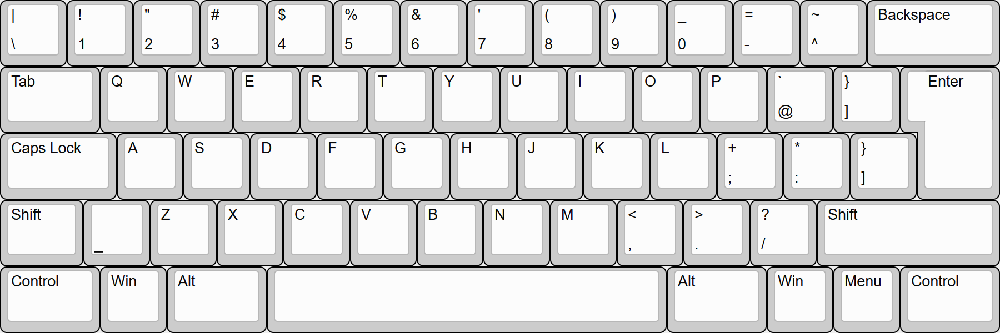

# United States - ASCII keyboard

Variant of the standard QWERTY keyboard layout with the original ASCII shift states left intact.
 
## Building
Compilation requires Microsoft Keyboard Layout Creator (MSKLC) which can be obtained from the link below:
 
https://www.microsoft.com/en-us/download/details.aspx?id=102134
